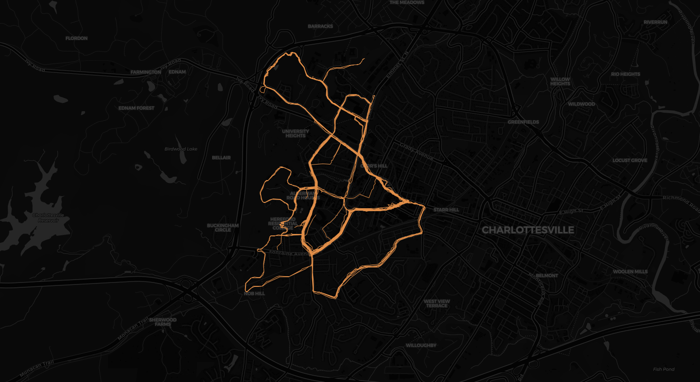

# strava-analysis-project

final_project.py is the main code I wrote for this project

This document has been really helpful for understanding how to parse GPX data: https://towardsdatascience.com/parsing-fitness-tracker-data-with-python-a59e7dc17418

I used the code from [here](https://github.com/bunburya/fitness_tracker_data_parsing/blob/main/parse_fit.py) for parsing my .fit data files

strava_ronith is my personal strava data, as such, I will render this project private in a week

